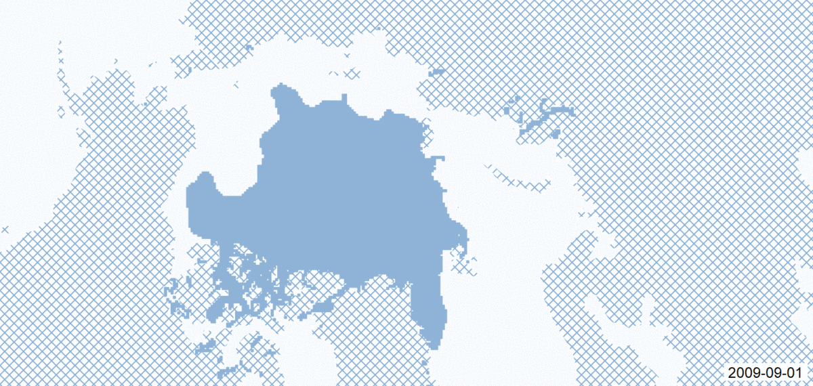

```{r setup, include=FALSE}
knitr::opts_chunk$set(echo = TRUE)
```

License: CC-0


## Visualization
**Gif vs. interactive animation:**

- Gif (short animation) is straightforward and self-explaining. It **quickly drags users' attention** and motivates them to engage with the data exploration.
- Gif is convenient because the data processing and comparison was already done and the results are visualy communicated to easily understand the dataset behavior and grasp the main information **without having to interact with the dataset.**
- Interactive animation **requires users' action** to interact with the dataset, which makes it more time consuming.
- _Conclusion:_ use gif to drag users' (readers') attention, while interactivity to enable user to do further data exploration.



**Visualization design:**

- Approach the visualization design by first answering _What is relevant?_ and _What do I want to show?_ Base your visualization-related decisions on these answers, e.g. the choice of the classification method.
- Use predefined color palletes to shorthen your work and try to get inspiration from really nice designs.
- GIS software is convenient for quick visualizations of geo-located data and understanding of their spatial spread while not requiring coding knowledge.
- While interactivity tools will probably be implemented by programming in a suitable language, short animations may be quickly produced with GIS software.

## Reproducibility

- Reproducible papers are cited more often, which is a strong argument to keep aware of this issue during research.
- A good way of documenting the research for reproducing it is by depositing the related information in an online repository.
- Well structured and maintained repositiories ensure high reproducibility.
- The reproducibility-related information should include properly described research methods, citing (or providing) data used, describing the implemented procedures, software and settings - up to a reasonable extent: neither too basic nor too detailed.
- The related citing in the paper should  state release version, Url, and DOI.
- My Github repository: <https://github.com/mzahtila>
- Always include license statement!

## Science Communication

- Write a paper in several phases: free writing, revising (iterated), peer review.
- Do free writing without too much thinking of the validity of ideas, or grammar. You can revise them later.
- Follow IMRD structure in a paper: introduction, methodology, results, discussion.
- Results are the most important part of the paper.
- Try writing the abstract first: This helps in creating the structure of the paper, and defining what it will tell.
- Alway immagine how would others interpret or percieve my research (article, presenatation) - It might be different from my own ideas.


**Telling a story with the article:**

1.	Plot: supporting decision making by visual perception of numbers.
2.	Main character: social media data, or even more specific, social-media-related numbers.
3.	
4.	Solution: approach visualization of numbers that relate to a specific location in a novel way, which can be intuitively understood.
5.	Results: should imply intuitive perception of statistics, which can be challenging in tabular representations.


**Structuring the paper/research according to Brown’s 8 questions:**

1.	Frank Ostermann (social media), Manuel Lima (visualization, professional, Visual Complexity), Michael Lee Gleicher (visualization, academic, Task-Driven Comparison of Topic Models )
2.	I have thought of ways of how to visually represent geotagged numbers as gifs, namely from social media posts, in order to use them as additional explanatory element on a map. I have considered the GIS approach for processing the data and generating the visualization ideas.
3.	Gifs, or short animations, are straightforward and self-explaining animations that quickly drag users’ attention and motivate them to engage with the data exploration. 
4.	I tried GIS approach because GIS tools do not require coding for data processing, and it is a quick way to visually show the distribution of data and play around with different visualizations.
5.	In theory the method should bring a novelty of communicating statistical data.
6.	In practice the visualization should support experts and citizens in decision making.
7.	The key benefits are quick understanding of targeted information of complex datasets that help in the decision making process.
8.	One of the next steps is to implement ideas as interactive tools and do usability tests to make concussions on the results.
